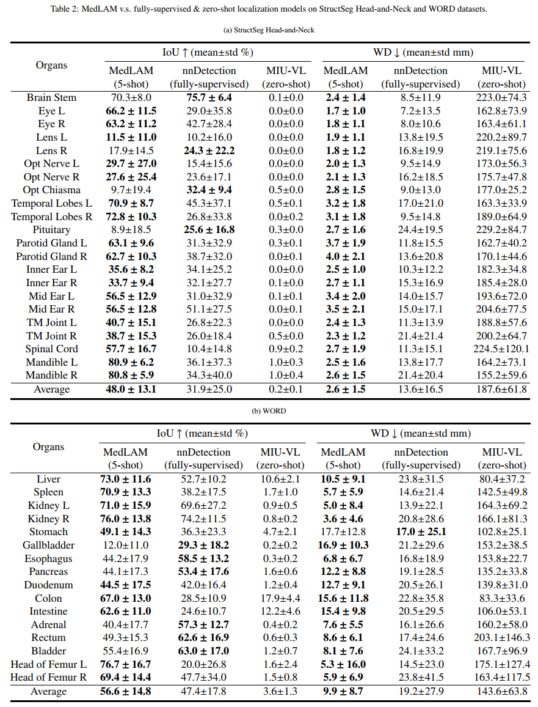

# [MedLSAM: Localize and Segment Anything Model for 3D Medical Images](https://arxiv.org/abs/2306.14752)
<!-- select Model and/or Data and/or Code as needed>
### Welcome to OpenMEDLab! 👋

<!--
**Here are some ideas to get you started:**
🙋‍♀️ A short introduction - what is your organization all about?
🌈 Contribution guidelines - how can the community get involved?
👩‍💻 Useful resources - where can the community find your docs? Is there anything else the community should know?
🍿 Fun facts - what does your team eat for breakfast?
🧙 Remember, you can do mighty things with the power of [Markdown](https://docs.github.com/github/writing-on-github/getting-started-with-writing-and-formatting-on-github/basic-writing-and-formatting-syntax)
-->


<!-- Insert the project banner here 
<div align="center">
    <a href="https://"></a>
</div>
-->
---

<!-- Select some of the point info, feel free to delete
[](https://twitter.com/opendilab)
[](https://pypi.org/project/DI-engine/)


[](https://codecov.io/gh/opendilab/DI-engine)


[](https://github.com/openmedlab/MedLSAM)
[](https://github.com/opendilab/DI-engine/network)

[](https://github.com/opendilab/DI-engine/issues)
[](https://github.com/opendilab/DI-engine/pulls)
[](https://github.com/opendilab/DI-engine/graphs/contributors)
[](https://github.com/opendilab/DI-engine/blob/master/LICENSE) -->

## Key Features

- **Foundation Model for 3D Medical Image Localization**: MedLAM: MedLSAM introduces MedLAM as a foundational model for the localization of 3D medical images.
- **First Fully-Automatic Medical Adaptation of SAM**: MedLSAM is the first complete medical adaptation of the Segment Anything Model (SAM). The primary goal of this work is to significantly reduce the annotation workload in medical image segmentation.
- **Segment Any Anatomy Target Without Additional Annotation**: MedLSAM is designed to segment any anatomical target in 3D medical images without the need for further annotations, contributing to the automation and efficiency of the segmentation process.


## Updates

- 2023.10.15: Accelerate the inference speed. Add Sub-Patch Localization (SPL).

<!-- give a introduction of your project -->
## Details

> The Segment Anything Model (SAM) has recently emerged as a groundbreaking model in the field of image segmentation. Nevertheless, both the original SAM and its medical adaptations necessitate slice-by-slice annotations, which directly increase the annotation workload with the size of the dataset. We propose MedLSAM to address this issue, ensuring a constant annotation workload irrespective of dataset size and thereby simplifying the annotation process. Our model introduces a few-shot localization framework capable of localizing any target anatomical part within the body. To achieve this, we develop a Localize Anything Model for 3D Medical Images (MedLAM), utilizing two self-supervision tasks: relative distance regression (RDR) and multi-scale similarity (MSS) across a comprehensive dataset of 14,012 CT scans. We then establish a methodology for accurate segmentation by integrating MedLAM with SAM. By annotating only six extreme points across three directions on a few templates, our model can autonomously identify the target anatomical region on all data scheduled for annotation. This allows our framework to generate a 2D bounding box for every slice of the image, which are then leveraged by SAM to carry out segmentations. We conducted experiments on two 3D datasets covering 38 organs and found that MedLSAM matches the performance of SAM and its medical adaptations while requiring only minimal extreme point annotations for the entire dataset. Furthermore, MedLAM has the potential to be seamlessly integrated with future 3D SAM models, paving the way for enhanced performance.

<!-- Insert a pipeline of your algorithm here if got one -->

*Fig.1 The overall segmentation pipeline of MedLSAM.*
<!--<div align="center">
    <a href="https://"></a>
</div> -->

## Feedback and Contact

- Email: lyc745307452@gmail.com
- Wechat: lyc4560147

## Get Started

### Main Requirements    
> torch>=1.11.0  
> tqdm  
> nibabel  
> scipy  
> SimpleITK  
> monai
### Installation
1. Create a virtual environment `conda create -n medlsam python=3.10 -y` and activate it `conda activate medlsam`
2. Install [Pytorch](https://pytorch.org/get-started/locally/)
3. `git clone https://github.com/openmedlab/MedLSAM`
4. Enter the MedSAM folder `cd MedLSAM` and run `pip install -e .`

### Download Model

Download [MedLAM checkpoint](https://drive.google.com/file/d/1cwoHS5yNPI22-jgMnoUo_yqj0U9Rab3E/view?usp=sharing), [SAM checkpoint](https://dl.fbaipublicfiles.com/segment_anything/sam_vit_b_01ec64.pth), [MedSAM checkpoint](https://drive.google.com/drive/folders/1ETWmi4AiniJeWOt6HAsYgTjYv_fkgzoN) and place them at `checkpoint/medlam.pth`, `checkpoint/sam_vit_b_01ec64.pth` and `checkpoint/medsam_vit_b.pth`

## Inference
### GPU requirement
We recommend using a GPU with 12GB or more memory for inference.

### Data preparation
- [StructSeg Task1 HaN OAR](https://drive.google.com/file/d/1tlv79tgK5ETBFUB3_vgipBPOwZLmpbi8/view?usp=drive_link) 
- [WORD](https://github.com/HiLab-git/WORD) (Request for access is required to download this dataset.)  

Note: You can also download other CT datasets and place them any place you want. MedLSAM will **automaticly** apply the preprocessing procedure during the inference time, so please do **not** normalize the original CT images!!!

After downloading the datasets, you should sort the data into "support" and "query" groups. This does not require moving the actual image files. Rather, you need to create separate lists of file paths for each group.

**For each group ("support" and "query"), perform the following steps:**   
1. Create a .txt file listing the paths to the image files.
2. Create another .txt file listing the paths to the corresponding label files.  

Ensure that the ordering of images and labels aligns in both lists. These lists will direct MedLSAM to the appropriate files during the inference process.  
The file names are not important, as long as the ordering of images and labels aligns in both lists.  

Example format for the .txt files:

- `image.txt`
```bash
/path/to/your/dataset/image_1.nii.gz
...
/path/to/your/dataset/image_n.nii.gz
```
- `label.txt`
```bash
/path/to/your/dataset/label_1.nii.gz
...
/path/to/your/dataset/label_n.nii.gz
```
### Config preparation
**MedLAM** and **MedLSAM** load their configurations from a .txt file. The structure of the file is as follows:
```bash
[data]
support_image_ls      =  config/data/StructSeg_HaN/support_image.txt
support_label_ls      =  config/data/StructSeg_HaN/support_label.txt
query_image_ls        =  config/data/StructSeg_HaN/query_image.txt
query_label_ls        =  config/data/StructSeg_HaN/query_label.txt
gt_slice_threshold    = 10
bbox_mode             = split
slice_interval        = 2
fg_class              = [1,2,3,4,5,6,7,8,9,10,11,12,13,14,15,16,17,18,19,20,21,22]
seg_save_path         = result/npz/StructSeg
seg_png_save_path     = result/png/StructSeg

[vit]
net_type                = vit_b

[weight]
medlam_load_path   = checkpoint/medlam.pth
vit_load_path  = checkpoint/medsam_20230423_vit_b_0.0.1.pth

```
Each of the parameters is explained as follows:

- `support_image_ls`: The path to the list of support image files.  It is recommended to use between 3 and 10 support images.
- `support_label_ls`: The path to the list of support label files.
- `query_image_ls`: The path to the list of query image files.
- `query_label_ls`: The path to the list of query label files.
- `gt_slice_threshold`: The threshold value for ground truth slice selection.
- `bbox_mode`: The bounding box mode. It could be `SPL` (Sub-Patch Localization) or `WPL` (Whole-Patch Localization), as shown in Fig.2.
- `slice_interval`: Specifies the number of slices in a sub-patch. A smaller value results in more patches. This parameter should be of type `int`, and its value should be greater than 0. **Applicable only for Sub-Patch Localization (SPL), set to `False` for Whole-Patch Localization (WPL)**.
- `fg_class`: The list of foreground class to be used for localization and segmentation. This could be a list of integers indicating the class labels. You can only select a part of them as target classes.
- `seg_save_path`: The path to save the segmentation results in .npz format, **only required for MedLSAM**.
- `seg_png_save_path`: The path to save the segmentation results in .png format, **only required for MedLSAM**.
- `net_type`: The type of vision transformer model to be used, **only required for MedLSAM**. By default, this is set to vit_b.
- `medlam_load_path`: The path to load the pretrained MedLAM model weights.
- `vit_load_path`: The path to load the pretrained vision transformer model weights, **only required for MedLSAM**. You can change it to `checkpoint/sam_vit_b_01ec64.pth` to use the SAM model as segmentation basis.

<div align="center">
  
</div>

*Fig.2 Comparison between Whole-Patch Localization (WPL) and Sub-Patch Localization (SPL) strategies.*


### Inference
- MedLAM (**Localize any anatomy target**)
```bash
CUDA_VISIBLE_DEVICES=0 python MedLAM_Inference.py --config_file path/to/your/test_medlam_config.txt
```
Example:
```bash
CUDA_VISIBLE_DEVICES=0 python MedLAM_Inference.py --config_file config/test_config/test_structseg_medlam.txt
CUDA_VISIBLE_DEVICES=0 python MedLAM_Inference.py --config_file config/test_config/test_word_medlam.txt
```

- MedLSAM (**Localize and segment any anatomy target with WPL/SPL**)
```bash
CUDA_VISIBLE_DEVICES=0 python MedLSAM_WPL_Inference.py --config_file path/to/your/test_medlsam_config.txt
CUDA_VISIBLE_DEVICES=0 python MedLSAM_SPL_Inference.py --config_file path/to/your/test_medlsam_config.txt
```
Example:
```bash
CUDA_VISIBLE_DEVICES=0 python MedLSAM_WPL_Inference.py --config_file config/test_config/test_structseg_medlam_wpl_medsam.txt
CUDA_VISIBLE_DEVICES=0 python MedLSAM_WPL_Inference.py --config_file config/test_config/test_structseg_medlam_spl_medsam.txt
CUDA_VISIBLE_DEVICES=0 python MedLSAM_SPL_Inference.py --config_file config/test_config/test_structseg_medlam_wpl_sam.txt
CUDA_VISIBLE_DEVICES=0 python MedLSAM_SPL_Inference.py --config_file config/test_config/test_structseg_medlam_spl_sam.txt
```

### Results
- MedLAM (Localize any anatomy target): MedLAM automatically calculates and saves the mean Intersection over Union (IoU) along with the standard deviation for each category in a .txt file. These files are stored under the result/iou directory.

<div align="center">
  
</div>

- MedLSAM (Localize and segment any anatomy target): MedLSAM automatically calculates and saves the mean Dice Similarity Coefficient (DSC) along with the standard deviation for each category in a .txt file. These files are stored under the result/dsc directory.


<div align="center">
  
</div>

## To do list
- [ ] Support scribble prompts
- [ ] Support MobliSAM

## 🛡️ License

This project is under the CC-BY-NC 4.0 license. See [LICENSE](LICENSE) for details.

## 🙏 Acknowledgement

- A lot of code is modified from [MedSAM](https://github.com/bowang-lab/MedSAM).
- We highly appreciate all the challenge organizers and dataset owners for providing the public dataset to the community.
- We thank Meta AI for making the source code of [segment anything](https://github.com/facebookresearch/segment-anything) publicly available.

## 📝 Citation

If you find this repository useful, please consider citing this paper:
```
@article{Lei2023medlam,
  title={MedLSAM: Localize and Segment Anything Model for 3D Medical Images},
  author={Wenhui Lei, Xu Wei, Xiaofan Zhang, Kang Li, Shaoting Zhang},
  journal={arXiv preprint arXiv:},
  year={2023}
}
```

<!-- ## Star History

[](https://star-history.com/#openmedlab/MedLSAM&Date) -->

